# Rt.me: A simple CPU-based ray tracer
(and monte carlo path tracer)

I created this ray tracer for the Computer Graphics: Rendering course at UoE. There is a pure ray tracing mode available, that implements:
- Blinn-Phong shading
- reflections
- refractions (dielectrics)
- textures
- point lights

The path tracing mode additionally supports:
- lens sampling for depth-of-field/Bokeh
- pixel sampling for anti-aliasing
- material sampling, including emissive materials; this enables area lights with soft shadows
- soft shadows for point lights
- smooth shading via vertex-normal interpolation
- Disney-esque BRDF materials

A bounding-volume hierarchy (BVH) is used as an acceleration structure.

    

        Note on the use of generative AI
    

    

        The course demanded the use of generative AI in writing parts of the ray tracer. I did not agree with this policy, so I employed these tools sparingly, and with great caution to try to avoid any bugs they may introduce.
    

# Example Renders

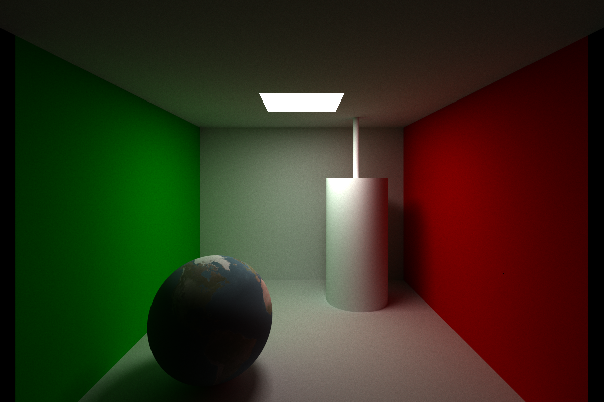

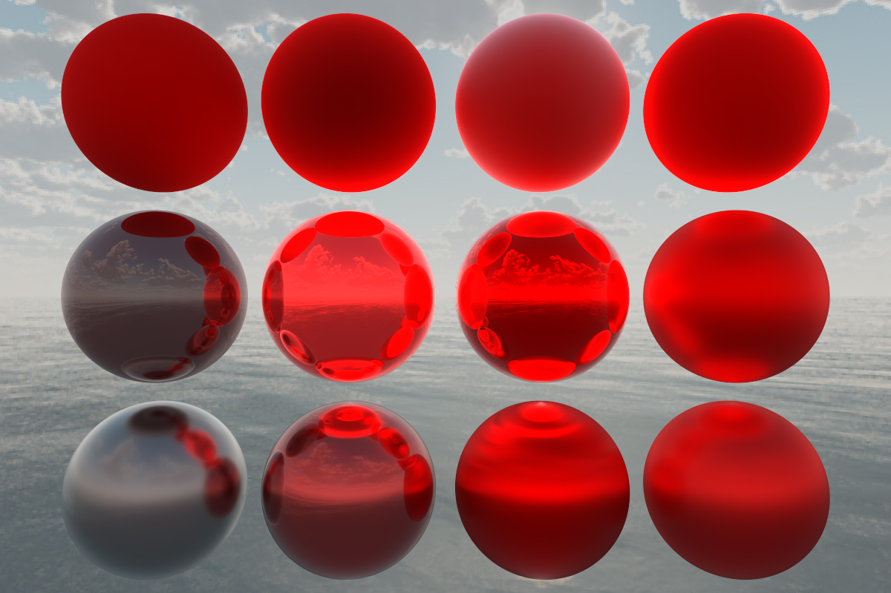

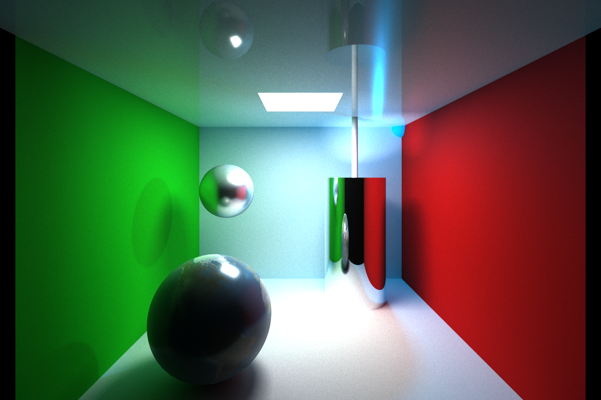

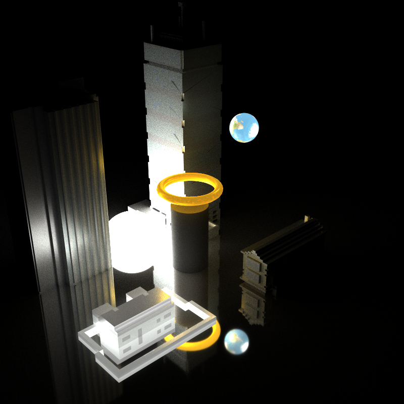

    

        <b>Labeled versions</b>
    

    

    Purely lambertian path tracing:
    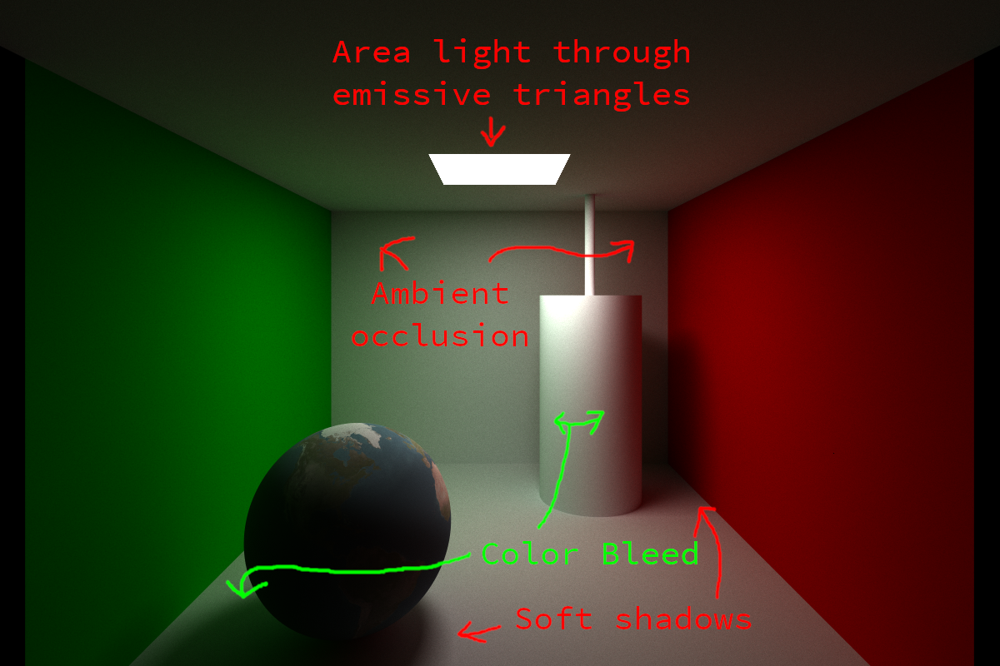
    

    

    Disney materials demo:
    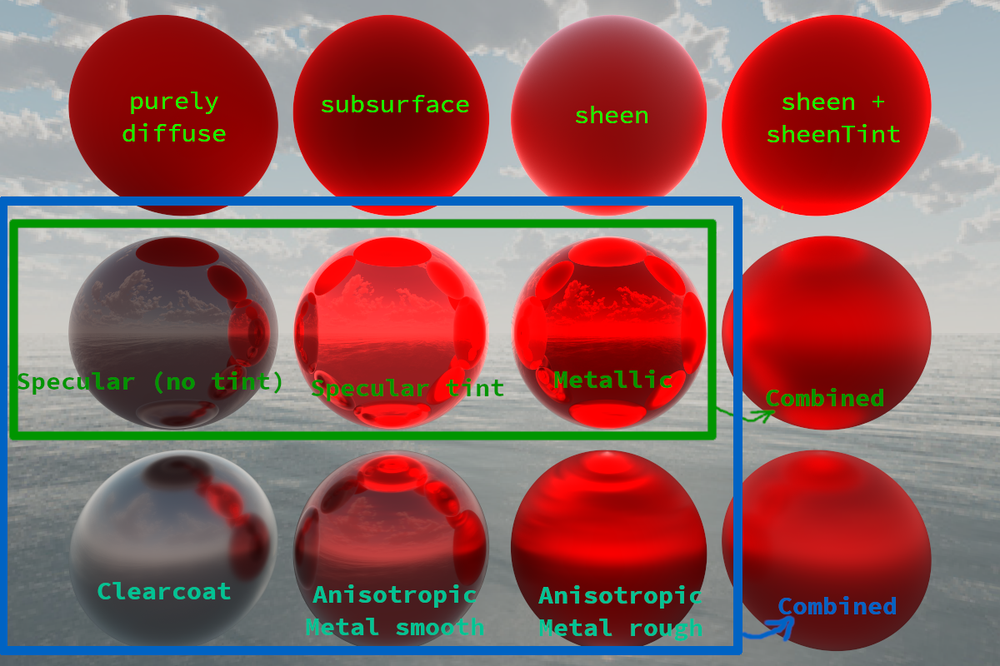
    

    

    Path tracing with disney materials:
    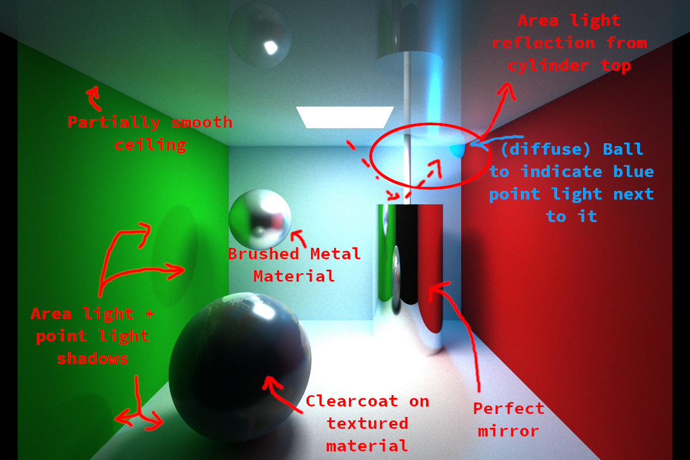
    

    

    More complex geometry and emissive lighting:
    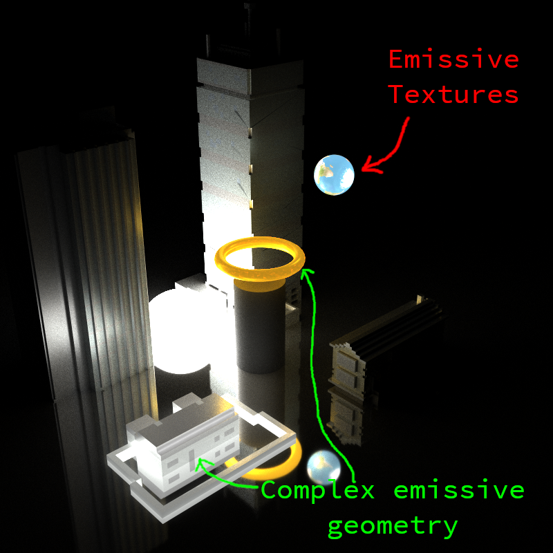
    

### Refractions
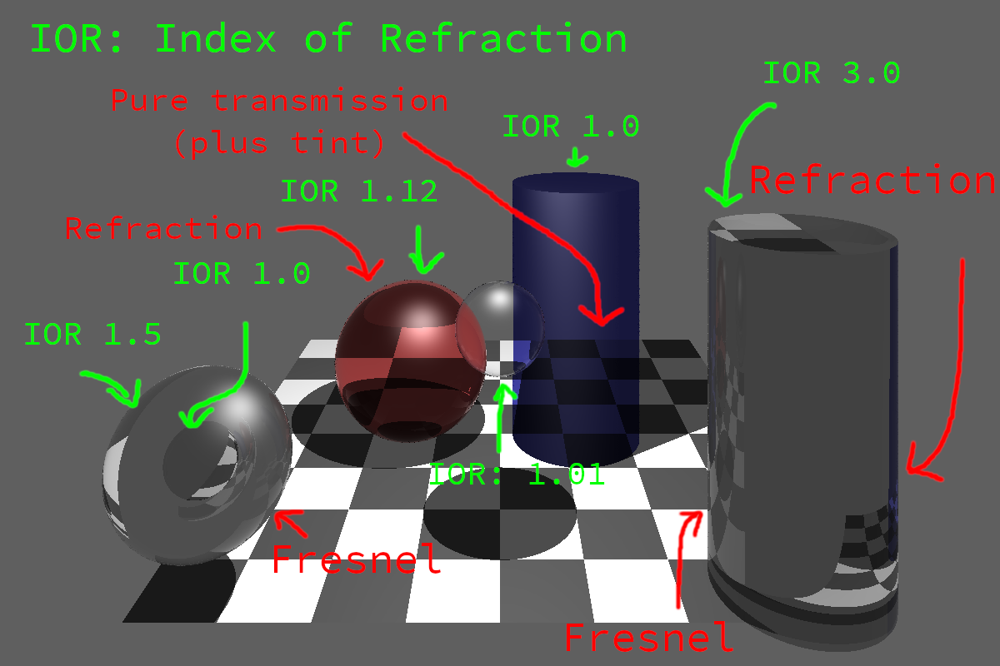

### BVH Debug Render
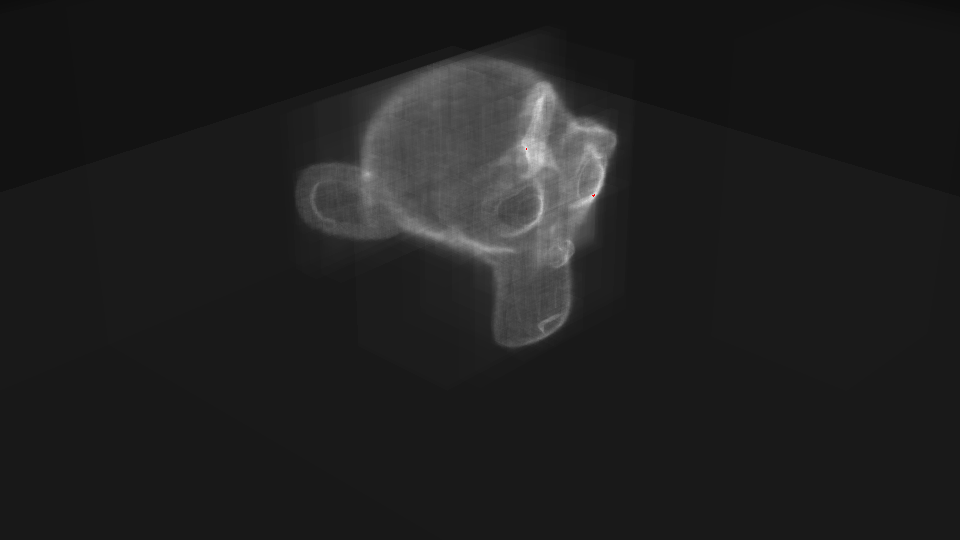

### Smooth shading
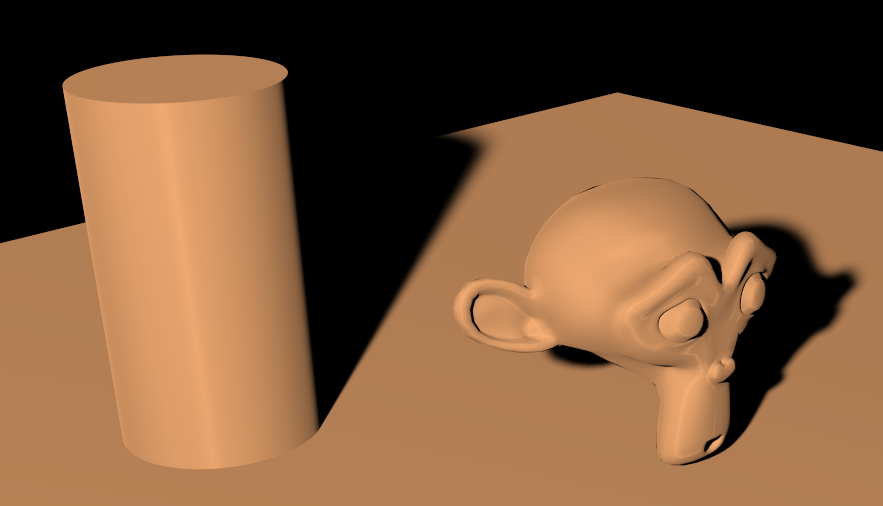

# Limitations
- Refractions (BSDFs) are not implemented in the path tracing mode
- Refracted light always transitions to the air when exiting a material, even if it is still inside another material
- Some heuristics (e.g. the Schlick Fresnel approximation) could be replaced with more accurate ones
